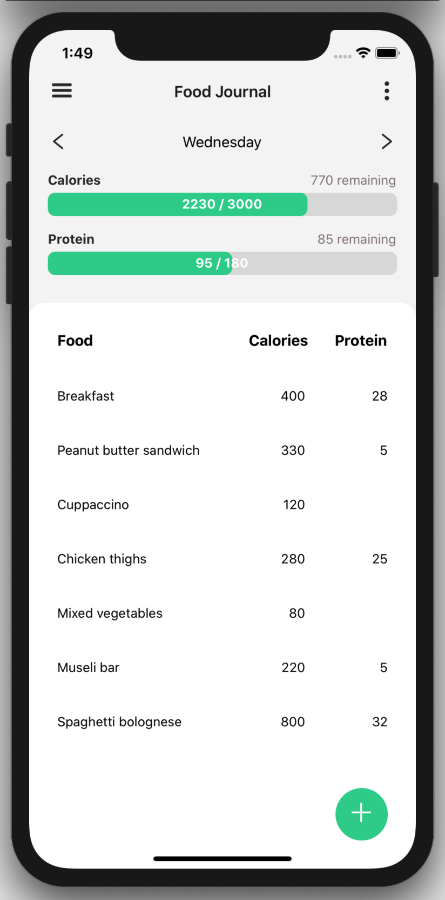

# Zipcall - Decentralized Video Chat

A dead simple daily calorie and protein. Built because all the other apps were overkill for someone who doesn't want to create an account, track graphs and generally has a good idea what the nutritional profile of their food is.

  

## Features

- Set daily calorie and protein goals
- Track daily progress
- Log and save food
- Convert between kj and calories

### Built with React Native and Expo
